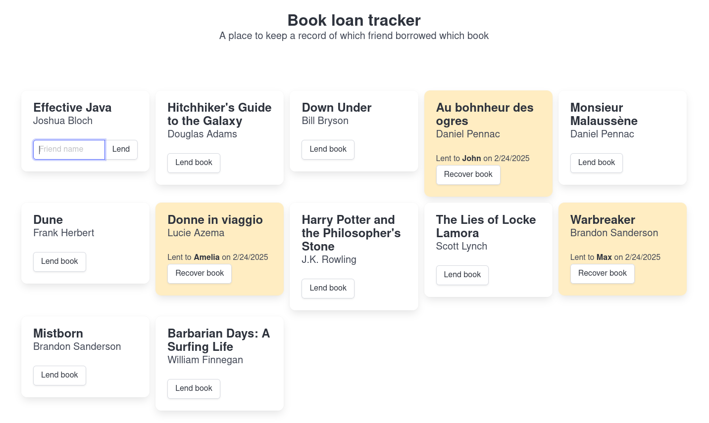

# Book loan tracker

This small app is a way to refresh some skills about [Spring Boot](https://spring.io/projects/spring-boot), [GraphQL](https://spring.io/guides/gs/graphql-server), [Vue.js](https://vuejs.org) and [Bulma](https://bulma.io).

## Getting started

Execute `make run` and visit [localhost:8080](http://localhost:8080/).

## Remaining todos

- [ ] books in author order
- [ ] actualy update books in backend